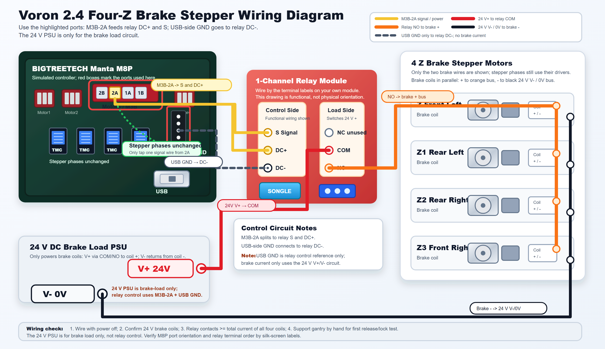
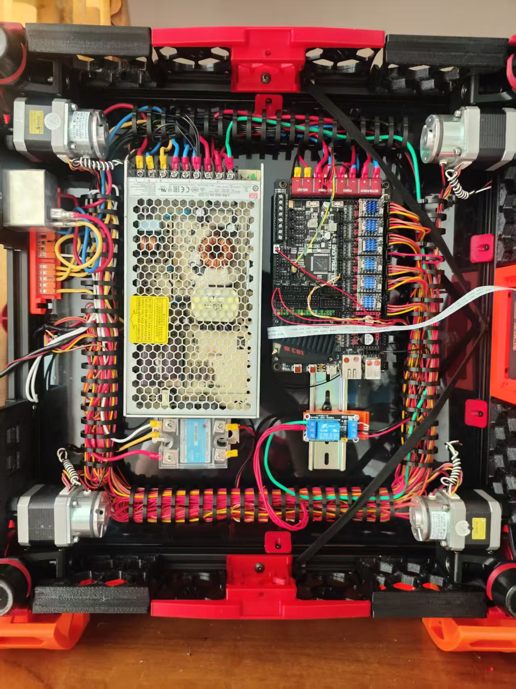
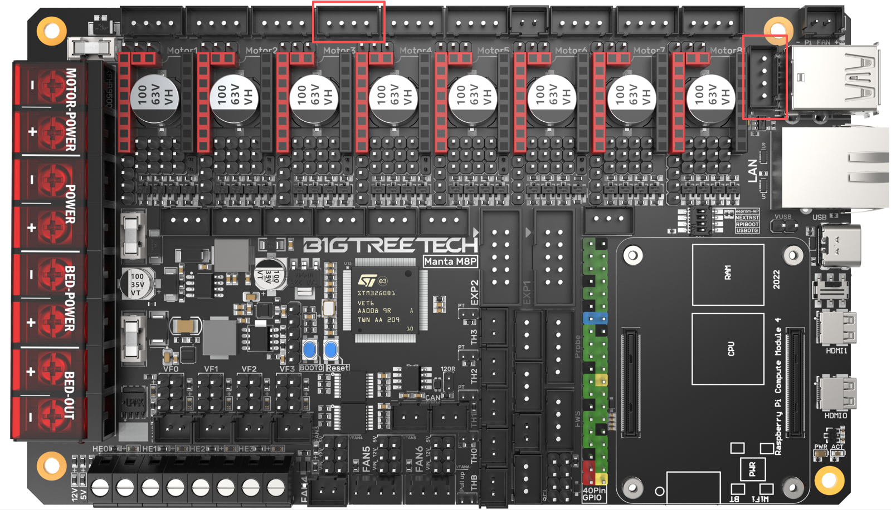
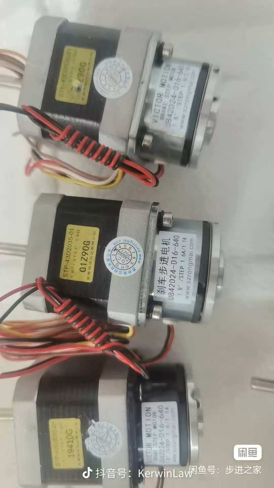

# Voron 2.4 Z Brake Stepper Mod

[简体中文](README.zh-CN.md)

This repository documents an experimental Voron 2.4 mod that uses four Z stepper motors with integrated brakes to reduce gantry drop when Z motor power is removed.

The implementation shown here uses a BIGTREETECH Manta M8P Motor3 / M3B `2A` line as the relay control source. The relay contact switches the separate 24 V brake load circuit.

## Reference Photos

These photos are included to help builders identify the parts and ports used by this mod. The wiring diagram and the labels on your own hardware should remain the source of truth.

| Electronics bay overview | Manta M8P highlighted ports |
| --- | --- |
|  |  |
| Brake stepper motors | Relay module reference |
|  |  |

See [reference photo notes](docs/photos.en.md) and [中文参考图片说明](docs/photos.zh-CN.md).

## What This Mod Does

- Keeps the original Z stepper motor phase wiring in place.
- Taps Manta M8P Motor3 / M3B `2A` as the relay control signal and control-side supply.
- Uses USB-side GND from the controller as relay `DC-`.
- Uses the relay contact to switch only the 24 V brake coil positive line.
- Wires all four brake coils in parallel.
- Leaves the brake engaged when control power is absent, so loss of control defaults to brake-on.

## Wiring Summary

Control side:

| Source | Relay terminal |
| --- | --- |
| Manta M8P Motor3 / M3B `2A` | `S` / signal |
| Manta M8P Motor3 / M3B `2A` | `DC+` |
| USB-side GND on the Manta M8P | `DC-` |

Brake load side:

| Source | Destination |
| --- | --- |
| 24 V brake PSU `V+` | Relay `COM` |
| Relay `NO` | All brake coil `+` wires |
| All brake coil `-` wires | 24 V brake PSU `V- / 0V` |
| Relay `NC` | Not connected |

See [English wiring notes](docs/wiring.en.md) and [中文接线说明](docs/wiring.zh-CN.md).

## Important Safety Notes

This is not an official Voron Design or BIGTREETECH modification.

- Do not route brake coil current through the Manta M8P, USB GND, or stepper driver output.
- The 24 V brake supply is only for the brake load circuit.
- The relay control side is powered by `M3B-2A` and USB GND in this mod.
- Confirm relay behavior with a multimeter before connecting the brake coils.
- Set the relay high/low trigger jumper so the brake releases only when the intended control signal is active.
- Size relay contacts, wiring, ferrules, and fuse protection for the total current of all four brake coils.
- Add flyback protection, TVS, or an RC snubber if the brake coils or relay module do not already include suppression.
- Test first with the gantry supported by hand.

See [safety notes](docs/safety.en.md).

## Klipper Notes

No extra Klipper output pin is used in this wiring. The relay follows the selected motor-driver-side signal instead of a normal MCU GPIO pin.

See [Klipper notes](docs/klipper.en.md) and [Klipper 中文说明](docs/klipper.zh-CN.md).

## Assets

- `assets/wiring-diagram.en.png` - shareable English wiring diagram
- `assets/wiring-diagram.en.svg` - editable English source diagram
- `assets/wiring-diagram.zh-CN.png` - shareable Chinese wiring diagram
- `assets/wiring-diagram.zh-CN.svg` - editable Chinese source diagram
- `assets/photos/` - reference photos for the electronics bay, board ports, brake steppers, and relay module

## License

Released under the MIT License. See [LICENSE](LICENSE).
