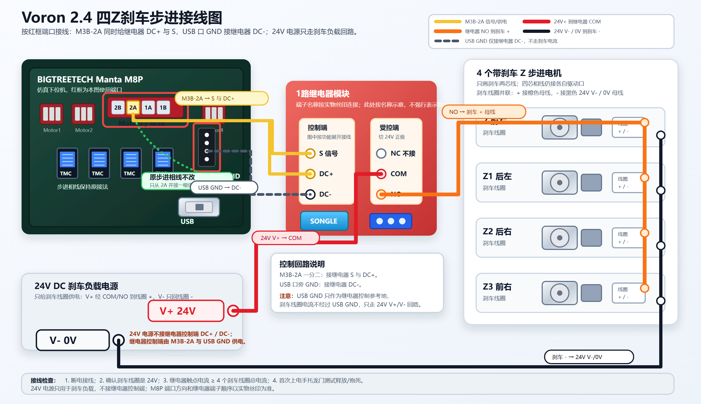

# Voron 2.4 四 Z 刹车步进 Mod

[English](README.md)

这是一套 Voron 2.4 四 Z 带刹车步进电机改造方案，用于降低 Z 电机断电或失能后龙门下坠的风险。

本方案以 BIGTREETECH Manta M8P 下位机 Motor3 / M3B 端口的 `2A` 线作为继电器控制侧的信号和供电来源，继电器触点只负责切换独立的 24V 刹车线圈负载回路。

## 参考图片

这些图片用于帮助爱好者定位本方案用到的元器件和端口。实际接线仍以接线图、自己板子和模块上的丝印为准。

| 电器底仓实拍 | Manta M8P 红框端口参考 |
| --- | --- |
|  |  |
| 带刹车步进电机实物 | 继电器模块购买/参考截图 |
|  |  |

详细说明见 [中文参考图片说明](docs/photos.zh-CN.md)，英文版见 [reference photo notes](docs/photos.en.md)。

## 方案作用

- 原 Z 步进电机四芯相线保持原接法。
- 从 Manta M8P Motor3 / M3B 的 `2A` 并接继电器控制信号。
- 继电器控制端 `DC+` 与 `S` 均接 `M3B-2A`。
- 继电器控制端 `DC-` 接下位机 USB 口旁 GND。
- 继电器触点只切换 24V 刹车线圈正极。
- 四个刹车线圈并联。
- 控制信号丢失时刹车默认抱死，降低龙门掉落风险。

## 接线总览

继电器控制侧：

| 来源 | 继电器端子 |
| --- | --- |
| Manta M8P Motor3 / M3B `2A` | `S` / 信号触发端 |
| Manta M8P Motor3 / M3B `2A` | `DC+` / 控制侧正极 |
| Manta M8P USB 口旁 GND | `DC-` / 控制侧负极 |

刹车负载侧：

| 来源 | 去向 |
| --- | --- |
| 24V 刹车电源 `V+` | 继电器 `COM` |
| 继电器 `NO` | 四个刹车线圈 `+` |
| 四个刹车线圈 `-` | 24V 刹车电源 `V- / 0V` |
| 继电器 `NC` | 不接 |

详细步骤见 [中文接线说明](docs/wiring.zh-CN.md)，英文版见 [English wiring notes](docs/wiring.en.md)。

## 重要安全说明

这不是 Voron Design 或 BIGTREETECH 官方改造。

- 不要让刹车线圈电流经过 Manta M8P、USB GND 或步进驱动输出。
- 24V 刹车电源只用于刹车负载回路。
- 本方案中继电器控制侧由 `M3B-2A` 与 USB GND 供电。
- 接刹车线圈前，先用万用表确认继电器吸合和释放逻辑。
- 高/低电平触发跳帽按实物测试结果设置，确保只有目标信号有效时刹车释放。
- 继电器触点、导线、端子和保险按四个刹车线圈总电流选型。
- 如果刹车线圈或继电器模块没有内置吸收保护，请在线圈侧加反向二极管、TVS 或 RC 吸收。
- 首次上电测试时请手托龙门。

更多说明见 [安全说明](docs/safety.zh-CN.md)。

## Klipper 说明

本方案不额外占用 Klipper 输出引脚，不是常规 MCU GPIO 控制继电器方案。继电器跟随所选电机驱动侧信号。

见 [Klipper 中文说明](docs/klipper.zh-CN.md)，英文版见 [Klipper notes](docs/klipper.en.md)。

## 文件

- `assets/wiring-diagram.zh-CN.png` - 分享用 PNG 接线图
- `assets/wiring-diagram.zh-CN.svg` - 可编辑 SVG 源文件
- `assets/photos/` - 电器底仓、端口、刹车步进和继电器模块参考图片

## 许可证

本仓库使用 MIT License 开源。见 [LICENSE](LICENSE)。
